# Data Wrangling with DataFrames & Spark SQL
Data wrangling is the process of removing errors and combining complex data sets to make them more accessible and easier to analyze.
## Data Wrangling with PySpark
PySpark’s superiority over Pandas in regards to handling larger datasets stems from two of its most distinct features.
1. PySpark utilizes parallel processing

    Unlike Pandas, which runs all of its operations on a single machine, PySpark leverages parallel processing, which entails running operations in parallel with multiple machines, thereby attaining results with greater processing speeds.

2. PySpark implements lazy evaluation

    PySpark also optimizes its operations by incorporating lazy evaluation. Simply put, it will only derive the results of operations when necessary. This approach helps minimize the computation and run time of any data processing procedure.

This is a contrast to the Pandas library, which uses eager evaluation. All computations in Pandas are executed as soon as the operations are called, with the results immediately being stored in memory. While this is feasible for small datasets, it is a hindrance when scalability becomes a concern.

PySpark vs Pandas: Syntax

Fortunately, the syntax of PySpark data frames has a strong resemblance to those of Pandas.

For a better perspective, we will perform the same operations with Pandas when applicable.

## Create a Spark Session and Load a dataset
A spark session serves as an entry point for creating and manipulating data frames. It facilitates all subsequent operations in PySpark.

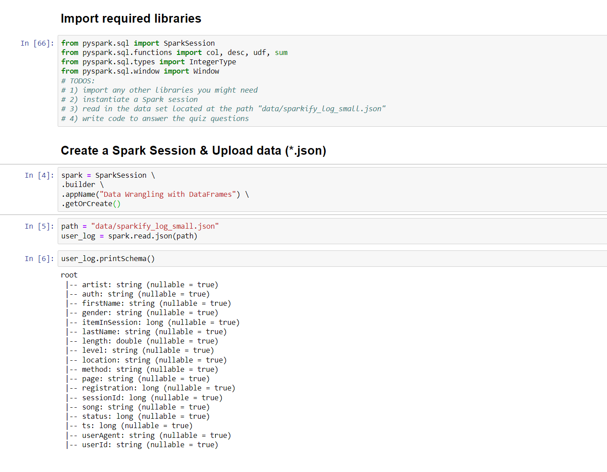

## We give some answers for 5 question by using Data Wrangling with DataFrames & Spark SQL:

### First, Data Wrangling with DataFrames:
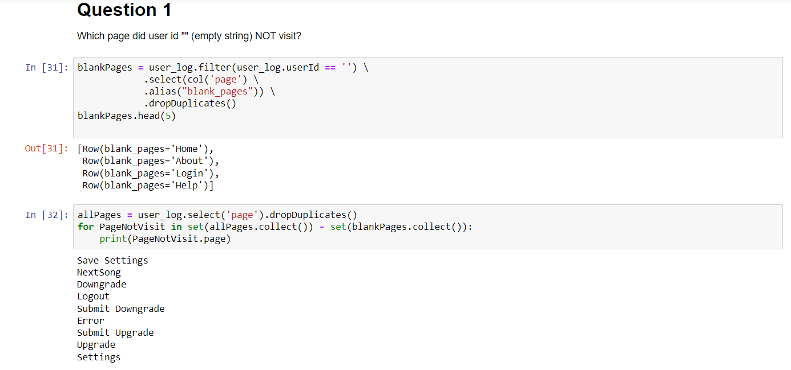
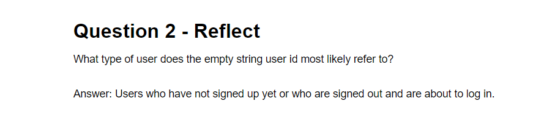
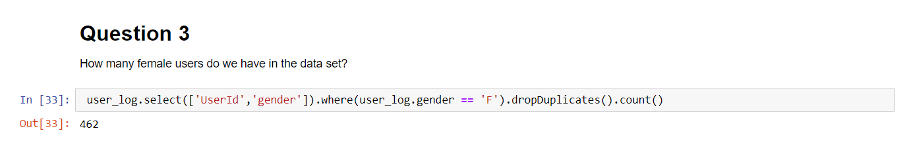
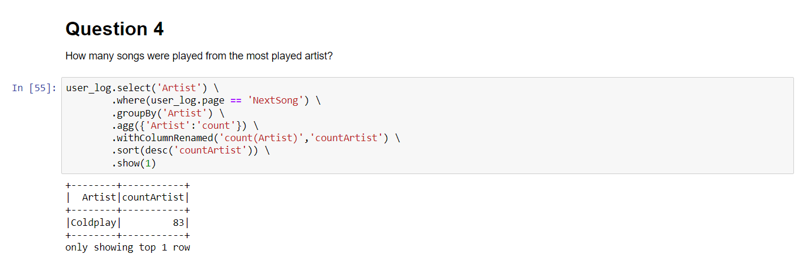
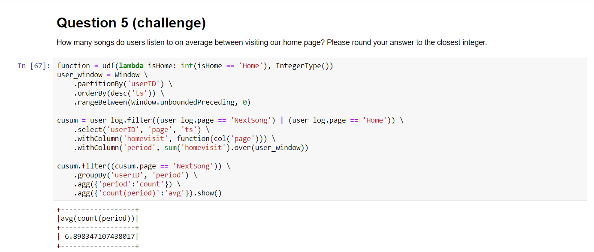

### Second, Data Wrangling with Spark SQL:
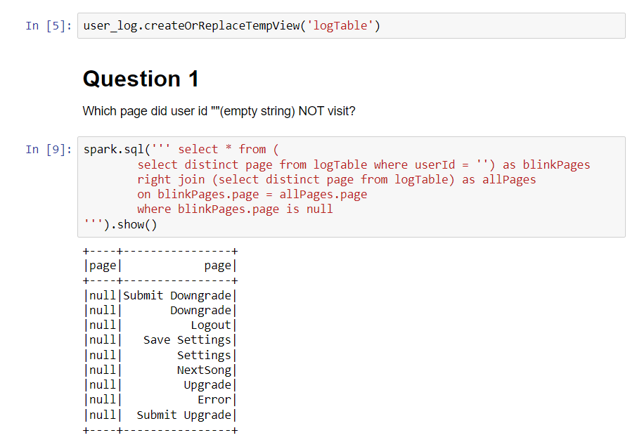
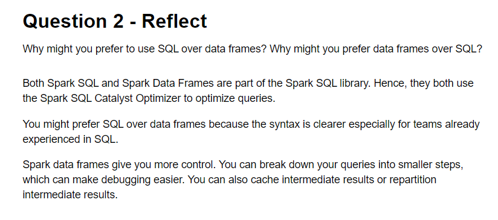
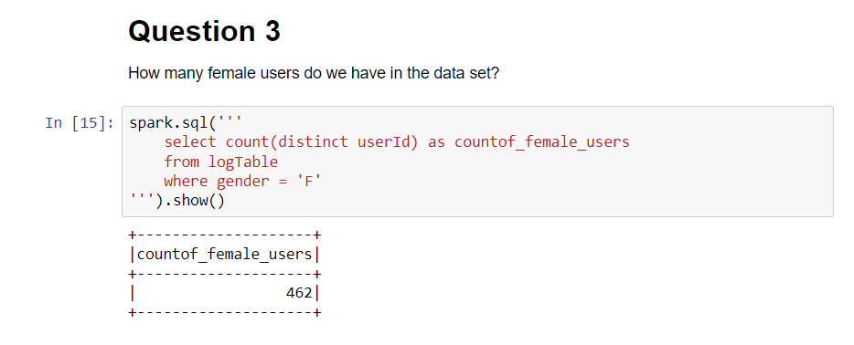
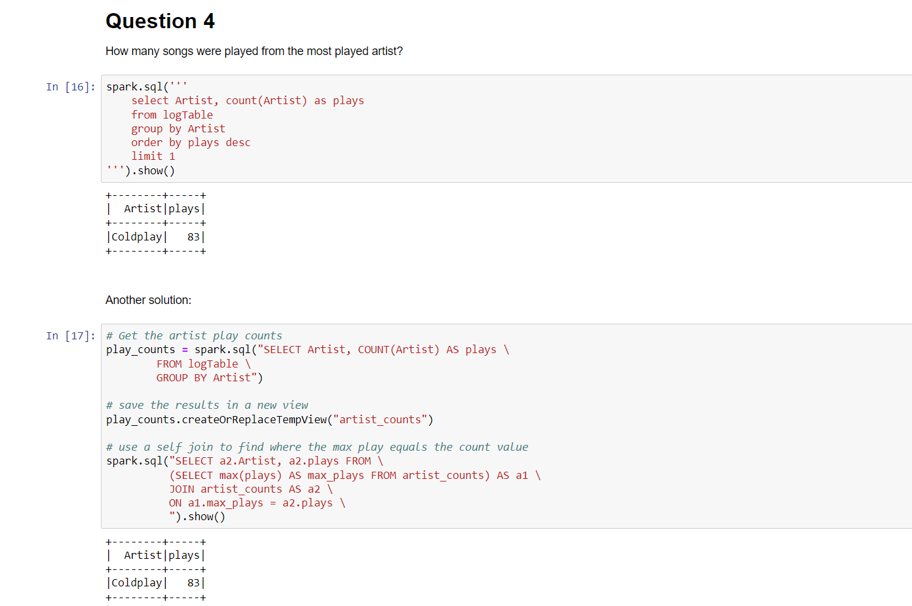
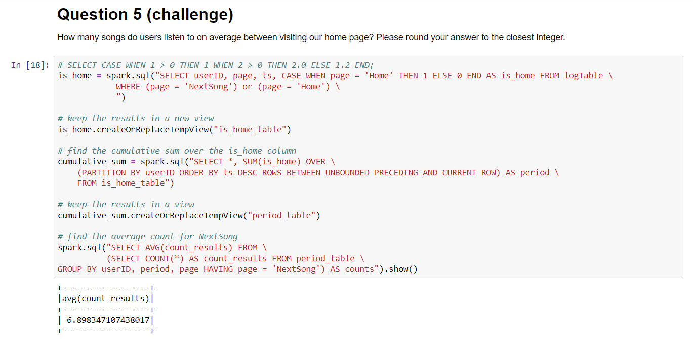